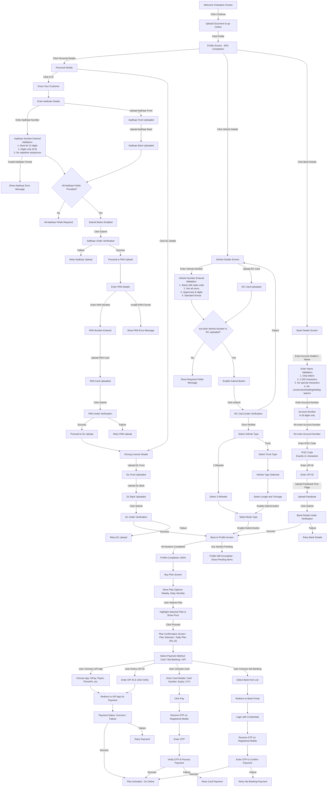

```mermaid
flowchart TD
  A["Welcome Champion Screen"] -- Click Continue --> B["Upload Document to go Online"]
  B -- Click Profile --> C["Profile Screen - 40% Completion"]

  C -- Click Personal Details --> PD["Personal Details"]
  C -- Click Vehicle Details --> E["Vehicle Details Screen"]
  C -- Click Bank Details --> F["Bank Details Screen"]

  PD -- Click KYC --> KYC["Know Your Customer"]
  PD -- Click DL Details --> DL["Driving License Details"]

  %% Aadhaar Flow (Mandatory)
  KYC --> K2["Enter Aadhaar Details"]
  K2 -- Enter Aadhaar Number --> K4["Aadhaar Number Entered <br> Validation:<br>1. Must be 12 digits<br>2. Digits only (0-9)<br>3. No repetitive sequences"]
  K2 -- Upload Aadhaar Front --> K5["Aadhaar Front Uploaded"]
  K5 -- Upload Aadhaar Back --> K6["Aadhaar Back Uploaded"]
  K4 -- Invalid Aadhaar Format --> KA["Show Aadhaar Error Message"]
  K4 --> K7{"All Aadhaar Fields Provided?"}
  K6 --> K7
  K7 -- No --> K8["All Aadhaar Fields Required"]
  K7 -- Yes --> K9["Submit Button Enabled"]
  K9 -- Click Submit --> K10["Aadhaar Under Verification"]
  K10 -- Failure --> K11["Retry Aadhaar Upload"]
  K10 -- Success --> K12["Proceed to PAN Upload"]

  %% PAN Flow (Mandatory)
  K12 --> K3["Enter PAN Details"]
  K3 -- Enter PAN Number --> K13["PAN Number Entered"]
  K13 -- Upload PAN Card --> K13A["PAN Card Uploaded"]
  K13A -- Click Submit --> K14["PAN Under Verification"]
  K14 -- Success --> K15["Proceed to DL Upload"]
  K14 -- Failure --> K16["Retry PAN Upload"]
  K3 -- Invalid PAN Format --> KB["Show PAN Error Message"]

  %% DL Flow (Mandatory)
  K15 --> DL
  DL -- Upload DL Front --> D13["DL Front Uploaded"]
  D13 -- Upload DL Back --> D14["DL Back Uploaded"]
  D14 -- Click Submit --> D15["DL Under Verification"]
  D15 -- Success --> G["Back to Profile Screen"]
  D15 -- Failure --> D16["Retry DL Upload"]

  %% Vehicle Details Flow
  E -- Enter Vehicle Number --> E1["Vehicle Number Entered <br> Validation:<br>1. Starts with state code<br>2. Not all zeros<br>3. Uppercase & digits<br>4. Standard format"]
  E -- Upload RC Card --> E2["RC Card Uploaded"]
  E1 --> E3{"Are both Vehicle Number & RC uploaded?"}
  E2 --> E3
  E3 -- No --> E4["Show Required Fields Message"]
  E3 -- Yes --> E5["Enable Submit Button"]
  E5 -- Click Submit --> E6["RC Card Under Verification"]
  E6 -- Failure --> E
  E6 -- Once Verified --> E7["Select Vehicle Type"]
  E7 -- 3 Wheeler --> E8["Select 3 Wheeler"]
  E8 --> E12["Select Body Type"]
  E7 -- Truck --> E9["Select Truck Type"]
  E9 --> E10["Vehicle Type Selected"]
  E10 --> E11["Select Length and Tonnage"]
  E11 -- Enable Submit button --> E12
  E12 -- Enable Submit button --> G

  %% Bank Details Flow
  F -->|Enter Account Holder's Name| F1[Enter Name <br> Validation:<br>1. Only letters<br>2. 2-200 characters<br>3. No special characters<br>4. No consecutive/leading/trailing spaces]
  F1 -->|Enter Account Number| F2[Account Number<br>6-18 digits only]
  F2 -->|Re-enter Account Number| F3[Re-enter Account Number]
  F3 -->|Enter IFSC Code| F4[IFSC Code<br>Exactly 11 characters]
  F4 -->|Enter UPI ID| F5[Enter UPI ID]
  F5 -->|Upload Passbook First Page| F6[Upload Passbook]
  F6 -->|Click Submit| F7[Bank Details Under Verification]
  F7 -->|Success| G
  F7 -->|Failure| F8[Retry Bank Details]

  %% Profile Completion Check
  G -->|All Sections Completed| H[Profile Completion 100%]
  G -->|Any Section Pending| I[Profile Still Incomplete - Show Pending Items]


  %% Continuing from Profile Completion
  H --> J[Buy Plan Screen]

  %% Buy Plan Flow (Screens in your image)
  J --> J1[Show Plan Options: Weekly, Daily, Monthly]
  J1 -->|User Selects Plan| J2["Highlight Selected Plan & Show Price"]
  J2 -->|Click Proceed| J3["Plan Confirmation Screen - Plan Selected - Daily Plan (Rs.15)"]
  J3 --> J4[Select Payment Method: Card / Net Banking / UPI]

  %% UPI Flow
  J4 -->|User Chooses UPI App| J5[Choose App: GPay, Paytm, PhonePe, etc.]
  J4 -->|User Enters UPI ID| J6[Enter UPI ID & Click Verify]
  J5 --> J7[Redirect to UPI App for Payment]
  J6 --> J7
  J7 --> J8[Payment Status: Success / Failure]
  J8 -->|Success| J9["Plan Activated - Go Online"]
  J8 -->|Failure| J10["Retry Payment"]

  %% Card Flow with OTP
  J4 -->|User Chooses Card| C1[Enter Card Details: Card Number, Expiry, CVV]
  C1 --> C2[Click Pay]
  C2 --> C3[Receive OTP on Registered Mobile]
  C3 --> C4[Enter OTP]
  C4 --> C5[Verify OTP & Process Payment]
  C5 -->|Success| J9
  C5 -->|Failure| C6["Retry Card Payment"]

  %% Net Banking Flow with OTP
  J4 -->|User Chooses Net Banking| N1[Select Bank from List]
  N1 --> N2[Redirect to Bank Portal]
  N2 --> N3[Login with Credentials]
  N3 --> N4[Receive OTP on Registered Mobile]
  N4 --> N5[Enter OTP to Confirm Payment]
  N5 -->|Success| J9
  N5 -->|Failure| N6["Retry Net Banking Payment"]
```


   

```
