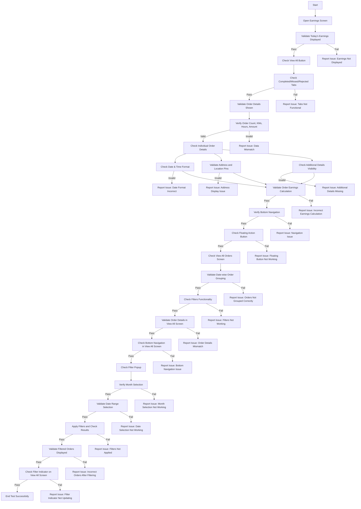

```mermaid
graph TD;
  A[Start] --> B[Open Earnings Screen]
  B --> C[Validate Today's Earnings Displayed]
  C -->|Pass| D[Check View All Button]
  C -->|Fail| Z1[Report Issue: Earnings Not Displayed]

  D --> E[Check Completed/Missed/Rejected Tabs]
  E -->|Pass| F[Validate Order Details Shown]
  E -->|Fail| Z2[Report Issue: Tabs Not Functional]
  
  F --> G[Verify Order Count, KMs, Hours, Amount]
  G -->|Valid| H[Check Individual Order Details]
  G -->|Invalid| Z3[Report Issue: Data Mismatch]

  H --> I[Check Date & Time Format]
  H --> J[Validate Address and Location Pins]
  H --> K[Check Additional Details Visibility]
  
  I -->|Invalid| Z4[Report Issue: Date Format Incorrect]
  J -->|Invalid| Z5[Report Issue: Address Display Issue]
  K -->|Invalid| Z6[Report Issue: Additional Details Missing]
  
  I --> L[Validate Order Earnings Calculation]
  J --> L
  K --> L
  
  L -->|Pass| M[Verify Bottom Navigation]
  L -->|Fail| Z7[Report Issue: Incorrect Earnings Calculation]

  M -->|Pass| N[Check Floating Action Button]
  M -->|Fail| Z8[Report Issue: Navigation Issue]
  
  N -->|Pass| O[Check View All Orders Screen]
  N -->|Fail| Z9[Report Issue: Floating Button Not Working]

  O --> P[Validate Date-wise Order Grouping]
  P -->|Pass| Q[Check Filters Functionality]
  P -->|Fail| Z10[Report Issue: Orders Not Grouped Correctly]

  Q -->|Pass| R[Validate Order Details in View All Screen]
  Q -->|Fail| Z11[Report Issue: Filters Not Working]

  R -->|Pass| S[Check Bottom Navigation in View All Screen]
  R -->|Fail| Z12[Report Issue: Order Details Mismatch]

  S -->|Pass| T[Check Filter Popup]
  S -->|Fail| Z13[Report Issue: Bottom Navigation Issue]

  T --> U[Verify Month Selection]
  U -->|Pass| V[Validate Date Range Selection]
  U -->|Fail| Z14[Report Issue: Month Selection Not Working]

  V -->|Pass| W[Apply Filters and Check Results]
  V -->|Fail| Z15[Report Issue: Date Selection Not Working]

  W -->|Pass| X[Validate Filtered Orders Displayed]
  W -->|Fail| Z16[Report Issue: Filters Not Applied]

  X -->|Pass| Y[Check Filter Indicator on View All Screen]
  X -->|Fail| Z17[Report Issue: Incorrect Orders After Filtering]

  Y -->|Pass| Z[End Test Successfully]
  Y -->|Fail| Z18[Report Issue: Filter Indicator Not Updating]
```
