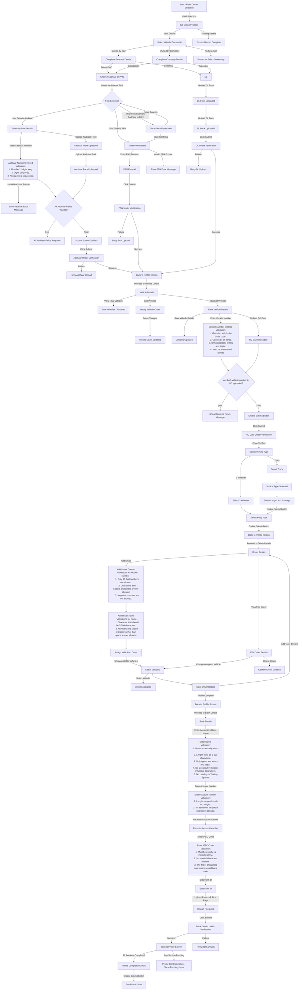

```mermaid
flowchart TD
    A["Start - Fleet Owner Selection"] -->|Valid Selection| B["Go Online Process"]
    B -->|Valid Details| C["Select Vehicle Ownership"]
    B <-->|Missing Details| B1["Prompt User to Complete"]
    
    C -->|Owned by You| D["Complete Personal Details"]
    C -->|Owned by Company| E["Complete Company Details"]
    C <-->|No Selection| C1["Prompt to Select Ownership"]

    %% KYC Flow (Aadhaar & PAN)
    D -->|Select KYC| KYC["Choose Aadhaar or PAN"]
    E -->|Select KYC| KYC
    
    KYC -->|Select Aadhaar or PAN| K1{KYC Selection}
    K1 -->|User Selects Aadhaar| K2["Enter Aadhaar Details"]
    K1 -->|User Selects PAN| K3["Enter PAN Details"]

    %% Aadhaar Upload Flow (All Fields Mandatory)
    K2 -->|Enter Aadhaar Number| K4["Aadhaar Number Entered <br> Validation: <br> 1. Must be 12 digits long. <br> 2. Digits only (0-9). <br> 3. No repetitive sequences."]
    K2 -->|Upload Aadhaar Front| K5["Aadhaar Front Uploaded"]
    K5 -->|Upload Aadhaar Back| K6["Aadhaar Back Uploaded"]

    K4 -->|"Invalid Aadhaar Format"| KA["Show Aadhaar Error Message"]
    K4 --> K7{All Aadhaar Fields Provided?}
    K6 --> K7

    K7 --|No|--> K8["All Aadhaar Fields Required"] 
    K7 --|Yes|--> K9["Submit Button Enabled"]

    K9 -->|Click Submit| K10["Aadhaar Under Verification"]
    K10 -->|"Failure"| K11["Retry Aadhaar Upload"]
    K10 -->|"Success"| G["Back to Profile Screen"]
  
    %% PAN Upload Flow
    K3 -->|Enter PAN Number| K12["PAN Entered"]
    K12 -->|Click Submit| K13["PAN Under Verification"]
    K13 -->|"Success"| G
    K13 -->|"Failure"| K14["Retry PAN Upload"]
    K3 -->|"Invalid PAN Format"| KB["Show PAN Error Message"]

    %% PAN Selection Alert
    K1 -->|"User Switches from Aadhaar to PAN"| KC["Show Data Reset Alert"]
    KC -->|User Confirms| K3
    KC -->|User Cancels| K1

    %% DL Upload Flow
    D -->|Select DL| DL
    E -->|Select DL| DL

    DL -->|Upload DL Front| D13["DL Front Uploaded"]
    D13 -->|Upload DL Back| D14["DL Back Uploaded"]
    D14 -->|Click Submit| D15["DL Under Verification"]
    D15 -->|"Failure"| D16["Retry DL Upload"]
    D15 -->|"Success"| G["Back to Profile Screen"]

    %% Vehicle Details Flow After Profile Completion
    G -->|Proceed to Vehicle Details| V["Vehicle Details"]
    V -->|View Total Vehicles| V1["Total Vehicles Displayed"]
    V -->|Edit Vehicles| V2["Modify Vehicle Count"]
    V2 -->|Save Changes| V3["Vehicle Count Updated"]
    V -->|Add/Edit Vehicles| V4["Enter Vehicle Details"]
    V4 -->|Save Vehicle Details| V5["Vehicles Updated"]

    %% Vehicle Details Flow (Updated)
    V4 -->|Enter Vehicle Number| E1["Vehicle Number Entered <br> Validation: <br> 1. Must start with Indian State code. <br> 2. Cannot be all zeros. <br> 3. Only uppercase letters and digits. <br> 4. Must be in standard format."]
    V4 -->|Upload RC Card| E2["RC Card Uploaded"]

    %% Enable Submit Button Only If Both Fields Are Entered
    E1 --> E3{Are both vehicle number & RC uploaded?}
    E2 --> E3

    E3 --|No|--> E4["Show Required Fields Message"]
    E3 --|Yes|--> E5["Enable Submit Button"]

    E5 -->|Click Submit| E6["RC Card Under Verification"]
    E6 --> |Once Verified|E7["Select Vehicle Type"]
    E7 --> |3 Wheeler|E8["Select 3 Wheeler"] -->E12
    E7 --> |Truck|E9["Select Truck"]-->E10["Vehicle Type Selected"]
    E10 --> E11["Select Length and Tonnage"]
    E11 -->|Enable Submit button|E12["Select Body Type"]
    E12 -->|Enable Submit button|P["Back to Profile Screen"]

    P -->|Proceed to Driver Details |F["Driver Details"]
    F -- Add Driver --> F1["Add Driver Contact
     Validations for Mobile Number -
    1. Only 10 digit numbers are allowed.
    2. Characters and Special characters are not allowed.
    3. Negative numbers are not allowed."]
    F1 --> F10["Add Driver Name
    Validations for Name -
    1. Character limit should be 2-200 characters.
    2. Numbers and special characters other than space are not allowed."]
    F10 --> F2["Assign Vehicle to Driver"]
    F2 -- Show Available Vehicles --> F3["List of Vehicles"]
    F3 -- Select Vehicle --> F4["Vehicle Assigned"]
    F3 --> F5["Save Driver Details"]
    F5 -- Add More Drivers --> F
    F5 -- Profile Complete --> P1["Back to Profile Screen"]
    F --View/Edit Driver --> F6["Edit Driver Details"]
    F6 -- Change Assigned Vehicle --> F3
    F6 -- Delete Driver --> F7["Confirm Driver Deletion"]
    P1 -->|Proceed to Bank Details|R["Bank Details"]

  R -->|Enter Account Holder's Name| R1[Enter Name <br> Validation: <br> 1. Must contain only letters . <br> 2. Length msut be 2-200 characters. <br> 3. Only uppercase letters and digits. <br> 4. No Consecutive Spaces or Special Characters. <br> 5. No Leading or Trailing Spaces.]
  R1 -->|Enter Account Number| R2[Enter Account Number <br> Validation: <br> 1. Length ramges from 6 to 18 digits. <br> 2. No alphabets or special characters allowed.]
  R2 -->|Re-enter Account Number| R3[Re-enter Account Number]
  R3 -->|Enter IFSC Code| R4[Enter IFSC Code <br> Validation: <br> 1. Must be exactly 11 characters long. <br> 2. No special characters allowed. <br> 3. The first 4 characters must match a valid bank code.]
  R4 -->|Enter UPI ID| R5[Enter UPI ID]
  R5 -->|Upload Passbook First Page| R6[Upload Passbook]
  R6 -->|Click Submit| R7[Bank Details Under Verification]
  R7 -->|"Success"|Q["Back to Profile Screen"]
  R7 -->|"Failure"| R8[Retry Bank Details]

  
%% Profile Completion Check
  Q -->|All Sections Completed| S[Profile Completion 100%]
  Q -->|Any Section Pending| T[Profile Still Incomplete - Show Pending Items]
  S -->|Enable Submit button | U["Buy Plan & Start "]
```
