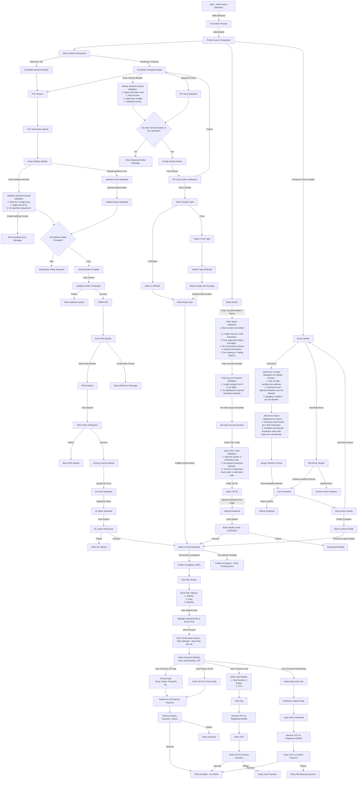

```mermaid
flowchart TD
    A["Start - Fleet Owner Selection"] -- Valid Selection --> B["Go Online Process"]
    B -- Valid Details --> B1["Profile Screen Completion"]
    B1 --> C["Select Vehicle Ownership"] & R["Bank Details"]
    C -- Owned by You --> D["Complete Personal Details"]
    C -- Owned by Company --> E["Complete Company Details"]
    D --> KYC["KYC Section"]
    E --> KYC
    KYC --> K1["KYC Document Upload"]
    K1 --> K2["Enter Aadhaar Details"]
    K2 -- Enter Aadhaar Number --> K4["Aadhaar Number Entered <br> Validation: <br> 1. Must be 12 digits long. <br> 2. Digits only (0-9). <br> 3. No repetitive sequences."]
    K2 -- Upload Aadhaar Front --> K5["Aadhaar Front Uploaded"]
    K5 -- Upload Aadhaar Back --> K6["Aadhaar Back Uploaded"]
    K4 -- Invalid Aadhaar Format --> KA["Show Aadhaar Error Message"]
    K4 --> K7{"All Aadhaar Fields Provided?"}
    K6 --> K7
    K7 -- |No| --> K8["All Aadhaar Fields Required"]
    K7 -- |Yes| --> K9["Submit Button Enabled"]
    K9 -- Click Submit --> K10["Aadhaar Under Verification"]
    K10 -- Failure --> K11["Retry Aadhaar Upload"]
    K10 -- Success --> PANFLOW["PANFLOW"]
    PANFLOW --> K3["Enter PAN Details"]
    K3 -- Enter PAN Number --> K12["PAN Entered"]
    K3 -- Invalid PAN Format --> KB["Show PAN Error Message"]
    K12 -- Click Submit --> K13["PAN Under Verification"]
    K13 -- Failure --> K14["Retry PAN Upload"]
    K13 -- Success --> DL["Driving License Upload"]
    DL -- Upload DL Front --> D13["DL Front Uploaded"]
    D13 -- Upload DL Back --> D14["DL Back Uploaded"]
    D14 -- Click Submit --> D15["DL Under Verification"]
    D15 -- Failure --> D16["Retry DL Upload"]
    D15 -- Success --> G["Back to Personal Detail"]
    E -- Enter Vehicle Number --> E1["Vehicle Number Entered <br> Validation:<br>1. Starts with state code<br>2. Not all zeros<br>3. Uppercase &amp; digits<br>4. Standard format"]
    E -- Upload RC Card --> E2["RC Card Uploaded"]
    E1 --> E3{"Are both Vehicle Number & RC uploaded?"}
    E2 --> E3
    E3 -- No --> E4["Show Required Fields Message"]
    E3 -- Yes --> E5["Enable Submit Button"]
    E5 -- Click Submit --> E6["RC Card Under Verification"]
    E6 -- Failure --> E
    E6 -- Once Verified --> E7["Select Vehicle Type"]
    E7 -- 3 Wheeler --> E8["Select 3 Wheeler"]
    E8 --> E12["Select Body Type"]
    E7 -- Truck --> E9["Select Truck Type"]
    E9 --> E10["Vehicle Type Selected"]
    E10 --> E11["Select Length and Tonnage"]
    E11 -- Enable Submit button --> E12
    E12 -- Enable Submit button --> G
    B1 -- Proceed to Driver Details --> F["Driver Details"]
    F -- Add Driver --> F1["Add Driver Contact
     Validations for Mobile Number -
     1. Only 10 digit numbers are allowed.
     2. Characters and Special characters are not allowed.
     3. Negative numbers are not allowed."]
    F1 --> F10["Add Driver Name
     Validations for Name -
     1. Character limit should be 2-200 characters.
     2. Numbers and special characters other than space are not allowed."]
    F10 --> F2["Assign Vehicle to Driver"]
    F2 -- Show Available Vehicles --> F3["List of Vehicles"]
    F3 -- Select Vehicle --> F4["Vehicle Assigned"]
    F3 --> F5["Save Driver Details"]
    F5 -- Add More Drivers --> F
    F5 -- Profile Complete --> P1["Back to Driver Profile"]
    F -- View/Edit Driver --> F6["Edit Driver Details"]
    F6 -- Change Assigned Vehicle --> F3
    F6 -- Delete Driver --> F7["Confirm Driver Deletion"]
    P1 -- Proceed to Bank Details --> G
    R -- Enter Account Holder's Name --> R1["Enter Name <br> Validation: <br> 1. Must contain only letters . <br> 2. Length msut be 2-200 characters. <br> 3. Only uppercase letters and digits. <br> 4. No Consecutive Spaces or Special Characters. <br> 5. No Leading or Trailing Spaces."]
    R1 -- Enter Account Number --> R2["Enter Account Number <br> Validation: <br> 1. Length ramges from 6 to 18 digits. <br> 2. No alphabets or special characters allowed."]
    R2 -- "Re-enter Account Number" --> R3["Re-enter Account Number"]
    R3 -- Enter IFSC Code --> R4["Enter IFSC Code <br> Validation: <br> 1. Must be exactly 11 characters long. <br> 2. No special characters allowed. <br> 3. The first 4 characters must match a valid bank code."]
    R4 -- Enter UPI ID --> R5["Enter UPI ID"]
    R5 -- Upload Passbook First Page --> R6["Upload Passbook"]
    R6 -- Click Submit --> R7["Bank Details Under Verification"]
    R7 -- Success --> G
    R7 -- Failure --> R8["Retry Bank Details"]
    G -- All Sections Completed --> H["Profile Completion 100%"]
    G -- Any Section Pending --> I["Profile Incomplete - Show Pending Items"]
    H --> J["Buy Plan Screen"]
    J --> J1["Show Plan Options: 
  1. Weekly,
  2. Daily, 
  3. Monthly"]
    J1 -- User Selects Plan --> J2["Highlight Selected Plan & Show Price"]
    J2 -- Click Proceed --> J3["Plan Confirmation Screen - Plan Selected - Daily Plan (Rs.15)"]
    J3 --> J4["Select Payment Method: 
  Card / Net Banking / UPI"]
    J4 -- User Chooses UPI App --> J5["Choose App:
   GPay, Paytm, PhonePe, etc."]
    J4 -- User Enters UPI ID --> J6["Enter UPI ID & Click Verify"]
    J5 --> J7["Redirect to UPI App for Payment"]
    J6 --> J7
    J7 --> J8["Payment Status:
   Success / Failure"]
    J8 -- Success --> J9["Plan Activated - Go Online"]
    J8 -- Failure --> J10["Retry Payment"]
    J4 -- User Chooses Card --> C1["Enter Card Details: 
  1. Card Number, 2. 
  Expiry, 
  3. CVV"]
    C1 --> C2["Click Pay"]
    C2 --> C3["Receive OTP on Registered Mobile"]
    C3 --> C4["Enter OTP"]
    C4 --> C5["Verify OTP & Process Payment"]
    C5 -- Success --> J9
    C5 -- Failure --> C6["Retry Card Payment"]
    J4 -- User Chooses Net Banking --> N1["Select Bank from List"]
    N1 --> N2["Redirect to Bank Portal"]
    N2 --> N3["Login with Credentials"]
    N3 --> N4["Receive OTP on Registered Mobile"]
    N4 --> N5["Enter OTP to Confirm Payment"]
    N5 -- Success --> J9
    N5 -- Failure --> N6["Retry Net Banking Payment"]


```
