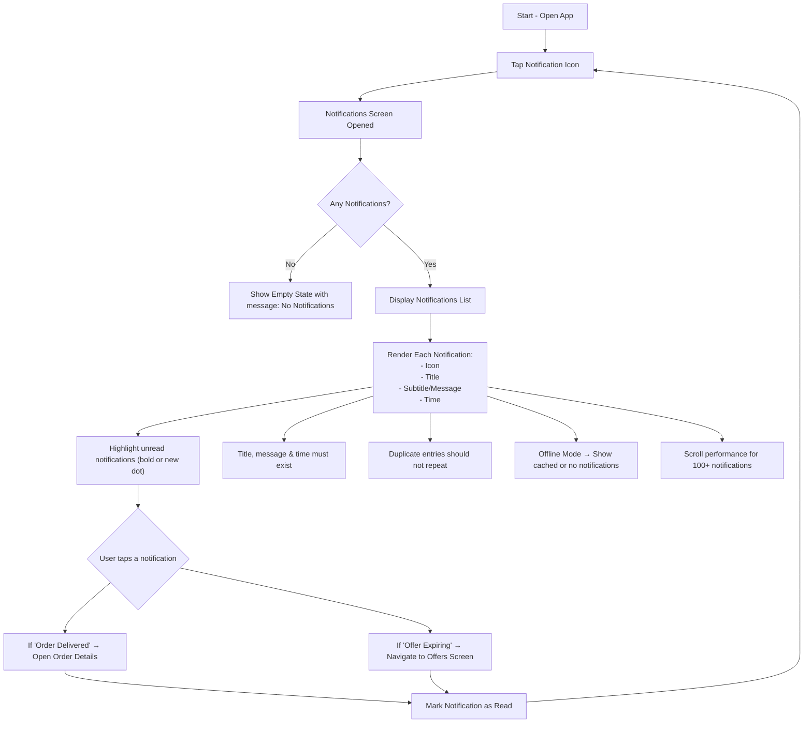

```mermaid
flowchart TD
    A[Start - Open App] --> B[Tap Notification Icon]
    B --> C[Notifications Screen Opened]

    %% Check for Notification State
    C --> D{Any Notifications?}
    D -->|No| E[Show Empty State with message: No Notifications]
    D -->|Yes| F[Display Notifications List]

    %% Valid Notifications
    F --> F1["Render Each Notification:<br>- Icon<br>- Title<br>- Subtitle/Message<br>- Time"]
    F1 --> F2["Highlight unread notifications (bold or new dot)"]

    %% Tapping on Notification
    F2 --> G{User taps a notification}
    G --> G1[If 'Order Delivered' → Open Order Details]
    G --> G2[If 'Offer Expiring' → Navigate to Offers Screen]

    %% Validations
    F1 --> V1[Title, message & time must exist]
    F1 --> V3[Duplicate entries should not repeat]

    %% Edge Cases
    
    F1 --> E4[Offline Mode → Show cached or no notifications]
    F1 --> E5[Scroll performance for 100+ notifications]

    G1 --> H[Mark Notification as Read]
    G2 --> H --> B

```
