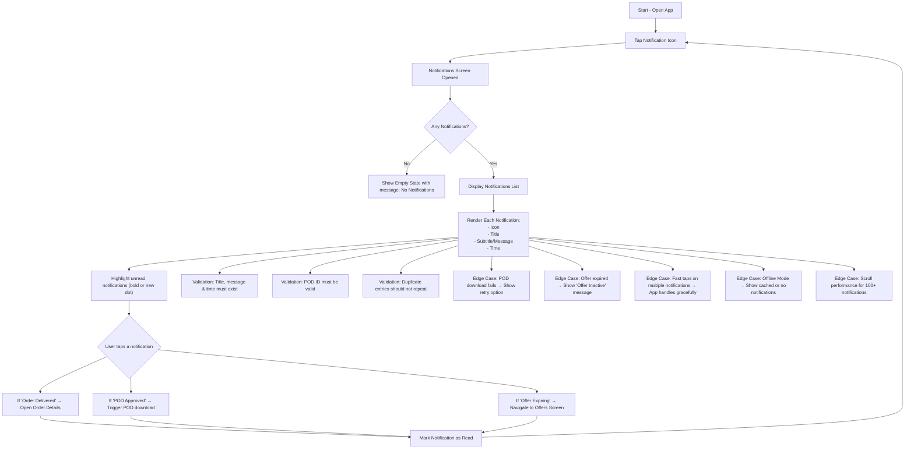

```mermaid
flowchart TD
    A[Start - Open App] --> B[Tap Notification Icon]
    B --> C[Notifications Screen Opened]

    %% Check for Notification State
    C --> D{Any Notifications?}
    D -->|No| E[Show Empty State with message: No Notifications]
    D -->|Yes| F[Display Notifications List]

    %% Valid Notifications
    F --> F1["Render Each Notification:<br>- Icon<br>- Title<br>- Subtitle/Message<br>- Time"]
    F1 --> F2["Highlight unread notifications (bold or new dot)"]

    %% Tapping on Notification
    F2 --> G{User taps a notification}
    G --> G1[If 'Order Delivered' → Open Order Details]
    G --> G2[If 'POD Approved' → Trigger POD download]
    G --> G3[If 'Offer Expiring' → Navigate to Offers Screen]

    %% Validations
    F1 --> V1[Validation: Title, message & time must exist]
    F1 --> V2[Validation: POD ID must be valid]
    F1 --> V3[Validation: Duplicate entries should not repeat]

    %% Edge Cases
    F1 --> E1[Edge Case: POD download fails → Show retry option]
    F1 --> E2[Edge Case: Offer expired → Show 'Offer Inactive' message]
    F1 --> E3[Edge Case: Fast taps on multiple notifications → App handles gracefully]
    F1 --> E4[Edge Case: Offline Mode → Show cached or no notifications]
    F1 --> E5[Edge Case: Scroll performance for 100+ notifications]

    G1 --> H[Mark Notification as Read]
    G2 --> H
    G3 --> H --> B

```
