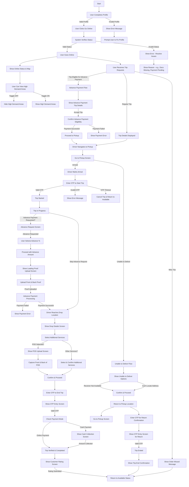

```mermaid 
graph TD;
    A1[Start] --> A
    A[User Completes Profile] -->|Valid Profile| B[User Clicks Go Online]
    A -->|Invalid Profile| E[Show Error Message]
    
    B --> C[System Verifies Status]
    C -->|Valid Status| D[User Goes Online]
    C -->|Invalid Status| F[Show Error - Resolve Issues]
    
    D --> G[Show Online Status & Map]
    G --> H[User Can View High Demand Areas]
    H -->|Toggle OFF| I[Hide High Demand Areas]
    H -->|Toggle ON| J[Show High Demand Areas]
    
    D --> K[User Receives Trip Requests]
    
    K -->|Trip Eligible for Advance Payment| AP1[Advance Payment Flow]
    AP1 --> AP2[Show Advance Payment Trip Details]
    AP2 -->|Accept Trip| AP3[Confirm Advance Payment Eligibility]
    AP3 -->|Payment Successful| AP4[Proceed to Pickup]
    AP3 -->|Payment Failed| AP5[Show Payment Error]
    
    K -->|Regular Trip| L[Trip Details Displayed]
    K -->|Miss Trip| M[Show Order Missed Message]
    
    AP4 --> N[Driver Navigates to Pickup]
    L --> N
    
    N --> O[Go to Pickup Screen]
    O -->|Arrived| P[Driver Marks Arrival]
    O -->|Unable to Deliver| P1[Unable to Deliver Flow]
    
    P1 --> P2[Show Unable to Deliver Options]
    P2 -->|Receiver Not Available| P3[Confirm & Proceed]
    P2 -->|Can't Locate Address| P3[Confirm & Proceed]

    P3 --> P4[Return to Pickup Location]
    P4 --> P5[Go to Pickup Screen]
    P4 --> P6[Enter OTP for Return Confirmation]
    P6 --> P7[Show OTP Entry Screen for Return]
    P7 -->|Valid OTP| P8[Trip Ended]
    P8 --> P9[Show Trip End Confirmation]
    P9 --> AA

    P --> Q[Enter OTP to Start Trip]
    Q -->|Valid OTP| R[Trip Started]
    Q -->|Invalid OTP| S[Show Error Message]
    Q -->|OTP Timeout| T[Cancel Trip & Return to Available]

    R --> U[Trip in Progress]
    
    U -->|Advance Payment Requested?| AR1[Advance Request Screen]
    AR1 -->|Advance Requested| AR2[User Selects Advance %]
    AR2 --> AR3[Proceed with Advance Amount]
    AR3 --> AR4[Show Loading Proof Upload Screen]
    AR4 --> AR5[Upload Front & Back Proof]
    AR6 -->|Payment Failed| AR7[Show Payment Error]
    AR5 -->|Proof Uploaded| AR6[Advance Payment Processing]
    AR6 -->|Payment Successful| V[Driver Reaches Drop Location]
    

    U -->|Skip Advance Request| V[Driver Reaches Drop Location]

    V --> W[Show Drop Details Screen]
    
    W --> X[Select Additional Services]
    X -->|POD Selected?| X1[Show POD Upload Screen]
    X1 --> X2[Capture Front & Back of POD]
    X2 --> X3[Confirm & Proceed]

    X -->|Other Services?| X4[Select & Confirm Additional Services]
    X4 --> X3

    X3 --> Y[Enter OTP to End Trip]
    Y --> Y1[Show OTP Entry Screen]
    Y1 -->|Valid OTP| Y2[Check Payment Mode]
    
    Y2 -->|Online Payment| Z[Trip Verified & Completed]
    Y2 -->|Cash Payment| Z1[Show Cash Collection Screen]
    Z1 -->|Amount Collected| Z[Trip Verified & Completed]

    Z --> Z2[Show Customer Rating Screen]
    Z2 -->|Rating Submitted| AA[Return to Available Status]

    M --> AA
    
    E --> AB[Prompt User to Fix Profile]
    F --> AC[Show Reason - e.g., Docs Missing, Payment Pending]
```
