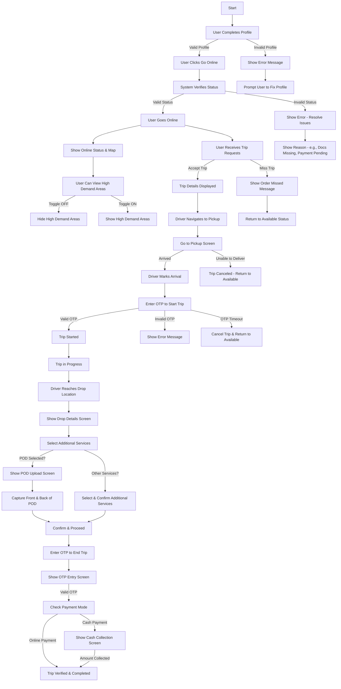

```mermaid 
graph TD;
    A1[Start] --> A
    A[User Completes Profile] -->|Valid Profile| B[User Clicks Go Online]
    A -->|Invalid Profile| E[Show Error Message]
    
    B --> C[System Verifies Status]
    C -->|Valid Status| D[User Goes Online]
    C -->|Invalid Status| F[Show Error - Resolve Issues]
    
    D --> G[Show Online Status & Map]
    G --> H[User Can View High Demand Areas]
    H -->|Toggle OFF| I[Hide High Demand Areas]
    H -->|Toggle ON| J[Show High Demand Areas]
    
    D --> K[User Receives Trip Requests]
    
    K -->|Accept Trip| L[Trip Details Displayed]
    K -->|Miss Trip| M[Show Order Missed Message]
    
    L --> N[Driver Navigates to Pickup]
    N --> O[Go to Pickup Screen]
    O -->|Arrived| P[Driver Marks Arrival]
    O -->|Unable to Deliver| P1[Trip Canceled - Return to Available]
    
    P --> Q[Enter OTP to Start Trip]
    Q -->|Valid OTP| R[Trip Started]
    Q -->|Invalid OTP| S[Show Error Message]
    Q -->|OTP Timeout| T[Cancel Trip & Return to Available]

    R --> U[Trip in Progress]
    U --> V[Driver Reaches Drop Location]
    V --> W[Show Drop Details Screen]
    
    W --> X[Select Additional Services]
    X -->|POD Selected?| X1[Show POD Upload Screen]
    X1 --> X2[Capture Front & Back of POD]
    X2 --> X3[Confirm & Proceed]

    X -->|Other Services?| X4[Select & Confirm Additional Services]
    X4 --> X3

    X3 --> Y[Enter OTP to End Trip]
    Y --> Y1[Show OTP Entry Screen]
    Y1 -->|Valid OTP| Y2[Check Payment Mode]
    
    Y2 -->|Online Payment| Z[Trip Verified & Completed]
    Y2 -->|Cash Payment| Z1[Show Cash Collection Screen]
    Z1 -->|Amount Collected| Z[Trip Verified & Completed]

    M --> AA[Return to Available Status]
    
    E --> AB[Prompt User to Fix Profile]
    F --> AC[Show Reason - e.g., Docs Missing, Payment Pending]
```
